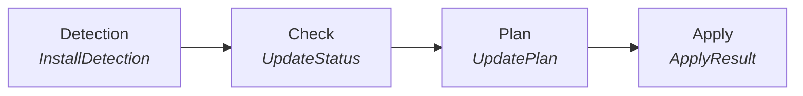
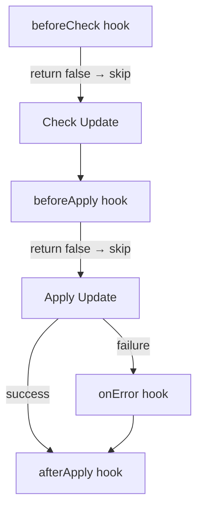
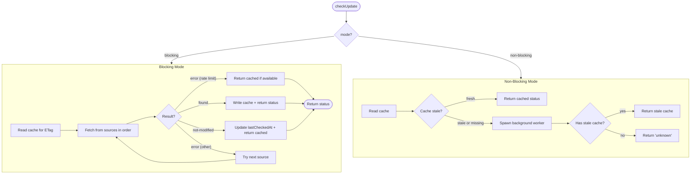

# update-kit Architecture Documentation

> **update-kit**: A channel-aware self-update toolkit for Node.js CLI applications. Detects how an app was installed and applies the appropriate update strategy automatically.

This document provides a detailed architectural overview of update-kit, including project structure, pipeline design, module organization, type system, and data flows.

---

## Table of Contents

1. [System Overview](#system-overview)
2. [Project Structure](#project-structure)
3. [Integration Patterns](#integration-patterns)
4. [Integration Decision Guide](#integration-decision-guide)
5. [Update Pipeline](#update-pipeline)
6. [Detection System](#detection-system)
7. [Version Checking](#version-checking)
8. [Version Source Plugin System](#version-source-plugin-system)
9. [Source Auto-Inference](#source-auto-inference)
10. [Cache System](#cache-system)
11. [Planner](#planner)
12. [Applier](#applier)
13. [Platform Abstraction](#platform-abstraction)
14. [Configuration System](#configuration-system)
15. [Type System](#type-system)
16. [Error Handling](#error-handling)
17. [UX Layer](#ux-layer)
18. [UX Customization](#ux-customization)
19. [CLI](#cli)
20. [Doctor: Integration Diagnostics](#doctor--integration-diagnostics)
21. [Public API Surface](#public-api-surface)
22. [Tunable Constants](#tunable-constants)
23. [Safety Policies](#safety-policies)

---

## System Overview

### High-Level Architecture

```
┌────────────────────────────────────────────────────────────────────────┐
│              update-kit — Channel-Aware Self-Update Toolkit             │
└────────────────────────────────────────────────────────────────────────┘

Host CLI App        Library API         Core Pipeline       External
────────────        ───────────         ─────────────       ────────

import UpdateKit ─→  UpdateKit       ─→  Detection      ─→  Path heuristics
                     (index.ts)          (detect/)          brew list
                     • checkAndNotify    • receipt           npm prefix
                     • autoUpdate        • brew              Symlink analysis
                     • switchVersion     • npm
                                         • heuristics
                            ↓                   ↓
                     Checker            ─→  GitHub API
                     (checker/)             npm registry
                     • blocking/            JSR registry
                       non-blocking         Brew API
                     • cache layer          Custom manifest
                            ↓
                     Planner            ─→  Pure function
                     (planner/)             Channel dispatch
                     • native-in-place      Confidence gating
                     • delegate-command     Asset selection
                     • manual-install
                            ↓
                     Applier            ─→  HTTPS download
                     (applier/)             SHA-256 verify
                     • native.ts            Archive extract
                     • delegate.ts          Atomic replace
                     • verify.ts            Package manager exec
```

### Key Components

| Component | Location | Responsibility |
|-----------|----------|----------------|
| **UpdateKit** | `src/index.ts` | Main orchestrator class, public API |
| **Detection** | `src/detection/` | Install channel detection (native, npm, brew, unmanaged) |
| **Checker** | `src/checker/` | Version checking with cache, blocking/non-blocking modes |
| **Sources** | `src/checker/sources/` | Pluggable version sources (GitHub, npm, JSR, Brew, custom) |
| **Planner** | `src/planner/` | Pure-function update plan generation |
| **Applier** | `src/applier/` | Plan execution (download, verify, extract, replace, delegate) |
| **Platform** | `src/platform/` | OS-specific cache paths and atomic file replacement |
| **UX** | `src/ux/` | Banner rendering, progress display, ANSI colors, hooks |
| **CLI** | `src/cli.ts` | Subcommand-based CLI interface |
| **Doctor** | `src/doctor.ts` | Diagnostic validation tool |

### Design Principles

1. **Channel-Aware**: Update strategy is determined by how the app was installed, not hardcoded
2. **Safety First**: HTTPS-only, checksum verification, atomic replacement, no privilege escalation
3. **Graceful Degradation**: Low-confidence detections fall back to manual instructions; errors never crash the host app
4. **Zero Config Possible**: Sources auto-inferred from `appName`, `repository`, and `package.json`
5. **Non-Intrusive**: `checkAndNotify()` is non-blocking by default; `delegateMode` defaults to `print-only`

---

## Project Structure

```
update-kit/
├── src/
│   ├── index.ts                 Public API — UpdateKit class + re-exports
│   ├── cli.ts                   CLI entry point (subcommands)
│   ├── config.ts                Configuration types and interfaces
│   ├── types.ts                 Core discriminated union types
│   ├── errors.ts                UpdateKitError class + error codes
│   ├── constants.ts             Timeout & interval defaults
│   ├── doctor.ts                Diagnostic validation tool
│   │
│   ├── detection/               Install Channel Detection
│   │   ├── index.ts             Main detection orchestrator
│   │   ├── receipt.ts           Install receipt file detection
│   │   ├── brew.ts              Homebrew cask detection
│   │   ├── npm.ts               npm-global detection
│   │   └── heuristics.ts        Path-based heuristic analysis
│   │
│   ├── checker/                 Version Checking
│   │   ├── index.ts             Blocking/non-blocking check logic
│   │   ├── cache.ts             Disk-based cache with atomic writes
│   │   ├── background.ts        Background update worker (spawned process)
│   │   ├── infer-sources.ts     Auto-infer sources from config
│   │   └── sources/             Version Source Plugins
│   │       ├── index.ts         VersionSource interface + factory
│   │       ├── base.ts          Base source class
│   │       ├── github.ts        GitHub Releases API
│   │       ├── npm-registry.ts  npm Registry API
│   │       ├── jsr.ts           JSR Registry API
│   │       ├── brew-api.ts      Homebrew API
│   │       └── custom-manifest.ts  Custom JSON manifest
│   │
│   ├── planner/                 Update Planning
│   │   └── index.ts             Pure-function plan generator
│   │
│   ├── applier/                 Update Application
│   │   ├── index.ts             Applier exports
│   │   ├── types.ts             ApplyOptions, DelegateApplyResult
│   │   ├── native.ts            Download → verify → extract → replace
│   │   ├── delegate.ts          Package manager command execution
│   │   └── verify.ts            SHA-256 checksum verification
│   │
│   ├── platform/                Platform Abstraction
│   │   ├── paths.ts             OS-specific cache directory paths
│   │   └── replace.ts           Atomic file replacement (Unix/Windows)
│   │
│   ├── ux/                      User Experience
│   │   ├── index.ts             Banner/progress/result rendering
│   │   ├── templates.ts         Customizable message templates
│   │   ├── colors.ts            ANSI color utilities (NO_COLOR aware)
│   │   └── hooks.ts             Lifecycle hook execution
│   │
│   ├── utils/                   Utilities
│   │   ├── http.ts              HTTP fetch with timeout/proxy support
│   │   ├── package-json.ts      package.json discovery & parsing
│   │   └── fs.ts                Filesystem helpers
│   │
│   └── __tests__/               Integration tests
│       └── ...
│
├── plugins/
│   └── update-kit-plugin/       Claude Code plugin (skill + command + agent)
│
├── docs/
│   ├── API.md                   Comprehensive API reference
│   ├── INDEX.md                 Project overview and task checklist
│   ├── plans/                   Design documents
│   └── tasks/                   Completed task specs (Korean)
│
├── package.json                 pnpm, tsup dual build (ESM + CJS)
├── tsconfig.json                TypeScript configuration
└── vitest.config.ts             Test configuration
```

### Build & Distribution

- **Package Manager**: pnpm (exclusively)
- **Build Tool**: tsup (ESM + CJS dual output)
- **Entry Points**: `./dist/index.mjs` (ESM) / `./dist/index.cjs` (CJS)
- **CLI Binary**: `./dist/cli.mjs`
- **Runtime Dependency**: `semver@^7.7.4` (only one)
- **Node.js**: 24.0.0+

---

## Integration Patterns

Integrators face a spectrum from "one-liner at startup" to "full manual pipeline with custom logic at every stage." The patterns below are ordered from simplest to most advanced.

### Pattern A: Startup Notification (Recommended Default)

Non-blocking, cache-based. Returns a banner or null. Never throws, never stalls.

```typescript
// In your CLI entry point (bin.ts or cli.ts)
import { UpdateKit } from 'update-kit';

const kit = await UpdateKit.create();          // auto-detects from package.json
const banner = await kit.checkAndNotify();     // reads cache, spawns background refresh
if (banner) console.error(banner);

// ... rest of your CLI logic
```

```
User runs CLI
  ↓
checkAndNotify()
  ├─ detectInstall()           → channel + confidence
  ├─ checkUpdate("non-blocking") → reads cache (fast), spawns background if stale
  └─ renderBanner(status)      → colored "Update available: 1.0.0 → 1.2.0" or null
  ↓
CLI runs normally (zero delay)
```

**When to use**: Every CLI app that wants zero-latency update notices.

### Pattern B: Dedicated Update Subcommand

Full `autoUpdate()` pipeline. Blocks until complete.

```typescript
// my-cli update
import { UpdateKit } from 'update-kit';

const kit = new UpdateKit({
  appName: 'my-cli',
  currentVersion: '1.0.0',
  delegateMode: 'execute',                    // actually run npm/brew commands
});

const result = await kit.autoUpdate({
  onProgress: (p) => {
    if (p.phase === 'downloading') {
      const pct = p.totalBytes ? Math.round(p.bytesDownloaded / p.totalBytes * 100) : '?';
      process.stderr.write(`\rDownloading... ${pct}%`);
    }
  },
});

switch (result.kind) {
  case 'success':    console.log(`Updated to ${result.toVersion}`); break;
  case 'up-to-date': console.log('Already up to date'); break;
  case 'needs-restart': console.log(result.message); break;
  case 'failed':     console.error(`Failed: ${result.error.message}`); process.exit(1);
}
```

**When to use**: CLI apps with an explicit `update` or `upgrade` subcommand.

### Pattern C: Manual Pipeline (Step-by-Step Control)

For apps that need custom logic between stages (e.g., confirm before apply, skip certain channels).

```typescript
const detection = await kit.detectInstall();
console.log(`Installed via: ${detection.channel} (${detection.confidence})`);

const status = await kit.checkUpdate('blocking');
if (status.kind !== 'available') { console.log('Up to date'); return; }

// Custom gate: skip major version updates
const [currentMajor] = status.current.split('.');
const [latestMajor] = status.latest.split('.');
if (currentMajor !== latestMajor) {
  console.log(`Major update ${status.latest} available — skipping auto-update`);
  return;
}

const plan = kit.planUpdate(status, detection);
if (!plan) { console.log('No applicable update plan'); return; }

const result = await kit.applyUpdate(plan);
```

**When to use**: Apps that need to gate updates by policy (e.g., skip major versions, require user confirmation, corporate compliance).

### Pattern D: Version Listing & Switching

Interactive version management for power users.

```typescript
// List available versions
const versions = await kit.listVersions({ limit: 10 });
if (versions.kind === 'success') {
  versions.versions.forEach(v => console.log(`  ${v.version}  ${v.publishedAt ?? ''}`));
}

// Switch to a specific version (upgrade or downgrade)
const result = await kit.switchVersion('1.3.2', { execute: true });
```

**When to use**: CLI apps with `my-cli versions` or `my-cli use <version>` commands.

### Pattern E: Hooks for Cross-Cutting Concerns

```typescript
const kit = new UpdateKit({
  appName: 'my-cli',
  currentVersion: '1.0.0',
  hooks: {
    beforeCheck: () => {
      if (process.env.CI) return false;        // skip update checks in CI
      return true;
    },
    beforeApply: (plan) => {
      // Gate: require user confirmation for major updates
      if (plan.toVersion.startsWith('2.')) return confirm('Apply major update?');
      return true;
    },
    afterApply: (result) => {
      telemetry.track('update_result', { kind: result.kind });
    },
    onError: (error) => {
      logger.warn('Update check failed', { code: error.code, message: error.message });
    },
  },
});
```

### Pattern F: Custom Detectors & Plan Resolvers

Extend detection for non-standard install channels and override plan strategy.

```typescript
const kit = new UpdateKit({
  appName: 'my-cli',
  currentVersion: '1.0.0',
  customDetectors: [{
    name: 'docker',
    detect: (execPath) => {
      if (execPath.includes('/.dockerenv') || fs.existsSync('/.dockerenv')) {
        return { channel: 'docker', confidence: 'high', evidence: [{ source: 'docker', detail: 'Running in Docker container' }] };
      }
      return null;
    },
  }],
  customPlanResolver: (ctx) => {
    if (ctx.channel === 'docker') {
      return { type: 'manual-install', reason: 'Docker image update required', instructions: 'Pull the latest image: docker pull my-cli:latest' };
    }
    return null;  // keep default plan
  },
});
```

---

## Integration Decision Guide

### Decision Tree: Which Pattern Do I Need?

```
Does your CLI need update notifications?
├── No → You don't need update-kit
└── Yes
    ├── Just a banner at startup? → Pattern A (checkAndNotify)
    └── Active update capability?
        ├── One-button update command? → Pattern B (autoUpdate)
        └── Need gates/policies between stages?
            └── Pattern C (manual pipeline)

Additional capabilities:
├── Version listing/switching? → Pattern D (listVersions + switchVersion)
├── CI/env-aware behavior?     → Pattern E (hooks)
└── Non-standard install channels (Docker, Nix, Snap)? → Pattern F (custom detectors)
```

### Decision Tree: Source Configuration

```
Do you want explicit control over where to check?
├── Yes → Provide sources[] in config
│   ├── Compiled binary distributed via GitHub Releases? → { type: "github" }
│   ├── Published on npm? → { type: "npm" }
│   ├── Published on JSR? → { type: "jsr" }
│   ├── Distributed via Homebrew? → { type: "brew" }
│   └── Self-hosted version manifest? → { type: "custom", url: "..." }
│
└── No → Omit sources (auto-inference)
    update-kit infers from:
    ├── config.repository / package.json.repository → GitHub source
    ├── config.npmPackageName / config.appName → npm source
    └── config.brewCaskName → Brew source
    Source query order is channel-aware (npm-installed → npm first)
```

### Decision Tree: Delegate Mode

```
What should happen for npm/brew-managed apps?
├── Show the command, let user run it → delegateMode: "print-only" (default)
│   Result: { kind: "success", message: "Run: npm install -g my-cli@2.0.0" }
│
└── Execute the command automatically → delegateMode: "execute"
    ⚠️ Requires explicit user intent (e.g., --execute flag)
    Allowed commands: npm, npx, brew, apt, yum, dnf, choco, winget, scoop
```

### Decision Tree: Post-Update Behavior

```
After a successful update, what should happen?
├── Native binary update
│   ├── High confidence + allowReexec: true → "reexec" (re-execute new binary)
│   └── Otherwise → "suggest-restart" (print restart hint)
│
├── Delegate command (npm/brew) → "exit-after-apply" (process exits)
│
└── Manual install → "none" (continue running)
```

### Config Complexity Spectrum

```
Minimal (zero-config with auto-detect):
  const kit = await UpdateKit.create();

Explicit identity:
  new UpdateKit({ appName: 'my-cli', currentVersion: '1.0.0' })

With source override:
  new UpdateKit({
    appName: 'my-cli', currentVersion: '1.0.0',
    sources: [{ type: 'github', owner: 'my-org', repo: 'my-cli' }],
  })

Fully customized:
  new UpdateKit({
    appName: 'my-cli', currentVersion: '1.0.0',
    sources: [...], delegateMode: 'execute', allowReexec: true,
    assetPattern: '{app}-{version}-{target}.tar.gz',
    customDetectors: [...], customPlanResolver: (ctx) => ...,
    hooks: { beforeCheck: ..., beforeApply: ..., afterApply: ..., onError: ... },
  })
```

### What Integrators Should Know About Each Result Kind

```
┌─────────────────┬──────────────────────────────────────────────────────────────┐
│ ApplyResult.kind│ What the integrator should do                                │
├─────────────────┼──────────────────────────────────────────────────────────────┤
│ "success"       │ Check postAction:                                            │
│                 │   "suggest-restart" → print "Please restart"                 │
│                 │   "exit-after-apply" → process.exit(0)                       │
│                 │   "reexec" → library handles re-execution                    │
│                 │   "none" → continue normally                                 │
├─────────────────┼──────────────────────────────────────────────────────────────┤
│ "up-to-date"    │ No action needed. Optionally print "Already up to date."     │
├─────────────────┼──────────────────────────────────────────────────────────────┤
│ "needs-restart" │ Display result.message to the user (manual-install plan)     │
├─────────────────┼──────────────────────────────────────────────────────────────┤
│ "failed"        │ Log result.error.message                                     │
│                 │ Check result.rollbackSucceeded:                              │
│                 │   true → original binary intact, safe to continue            │
│                 │   false → warn user, binary may be in unknown state          │
└─────────────────┴──────────────────────────────────────────────────────────────┘
```

### End-User Experience by Install Channel

```
┌──────────────┬──────────────────────────────────────────────────────────────┐
│ Install      │ What the end user sees                                       │
│ Channel      │                                                              │
├──────────────┼──────────────────────────────────────────────────────────────┤
│ npm-global   │ Banner: "Update available: 1.0.0 → 1.2.0"                   │
│              │ "Run `npm update -g my-cli` to update."                      │
│              │ (or auto-executed if delegateMode: "execute")                │
├──────────────┼──────────────────────────────────────────────────────────────┤
│ brew-cask    │ Banner: "Update available: 1.0.0 → 1.2.0"                   │
│              │ "Run `brew upgrade --cask my-cli` to update."               │
├──────────────┼──────────────────────────────────────────────────────────────┤
│ native       │ With assets: silent download → verify → extract → replace   │
│              │ Without assets: "Please download from ..."                   │
├──────────────┼──────────────────────────────────────────────────────────────┤
│ unmanaged    │ Best effort: tries native-in-place if assets available      │
│              │ Fallback: "Please reinstall using your preferred method"     │
├──────────────┼──────────────────────────────────────────────────────────────┤
│ Low          │ Always safe: prints instructions instead of auto-updating   │
│ confidence   │ "Please update manually: npm install -g my-cli"             │
└──────────────┴──────────────────────────────────────────────────────────────┘
```

---

## Update Pipeline

### Pipeline Stages

```
Detection → Check → Plan → Apply
```

The core pipeline is a four-stage process, each stage producing a typed output that feeds into the next:



### Convenience Methods

The `UpdateKit` class provides two convenience methods that orchestrate the full pipeline:

```
┌─────────────────────────────────────────────────────────────────────────┐
│ checkAndNotify() — One-liner for app startup                            │
│                                                                         │
│   detectInstall()                                                       │
│     ↓                                                                   │
│   checkUpdate("non-blocking", channel)  ← uses channel for source order │
│     ↓                                                                   │
│   renderBanner(status, detection) → string | null                       │
│                                                                         │
│   • Never throws — catches all errors and returns null                  │
│   • Non-blocking — reads cache, spawns background refresh if stale      │
│   • Returns formatted ANSI banner string or null                        │
└─────────────────────────────────────────────────────────────────────────┘

┌─────────────────────────────────────────────────────────────────────────┐
│ autoUpdate() — Full pipeline in one call                                │
│                                                                         │
│   detectInstall()                                                       │
│     ↓                                                                   │
│   checkUpdate("blocking", channel)                                      │
│     ↓                                                                   │
│   status.kind !== "available"? → return { kind: "up-to-date" }          │
│     ↓                                                                   │
│   planUpdate(status, detection, config, assets)                         │
│     ↓                                                                   │
│   applyUpdate(plan, options) → ApplyResult                              │
│                                                                         │
│   • Never throws — errors returned as { kind: "failed" }               │
│   • Blocking — fetches from sources directly                            │
│   • Runs lifecycle hooks: beforeCheck, beforeApply, afterApply, onError │
└─────────────────────────────────────────────────────────────────────────┘
```

### Lifecycle Hooks



```
┌──────────────┬──────────────────────────────────────────────────────────┐
│ Hook         │ Behavior                                                 │
├──────────────┼──────────────────────────────────────────────────────────┤
│ beforeCheck  │ Return false to skip version check entirely              │
│ beforeApply  │ Return false to abort update (receives UpdatePlan)       │
│ afterApply   │ Receives ApplyResult (success or failure)                │
│ onError      │ Receives UpdateKitError (for logging, telemetry)         │
└──────────────┴──────────────────────────────────────────────────────────┘
```

---

## Detection System

### Detection Priority

```
detectInstall(execPath, config) → InstallDetection

  Priority Order:
  ──────────────
  0. Custom detectors (user-provided, highest priority)
     └─ config.customDetectors[].detect(resolvedPath) → InstallDetection | null

  1. Install receipt (explicit record)
     └─ detectFromReceipt(config) → look for receipt file

  2. Homebrew patterns
     └─ detectFromBrew(resolvedPath, config)
        ├─ Path matches /usr/local/Caskroom/ or /opt/homebrew/Caskroom/
        └─ Verified with `brew list --cask`

  3. npm global patterns
     └─ detectFromNpm(resolvedPath)
        ├─ Path matches npm prefix + /lib/node_modules/
        ├─ Symlink analysis
        └─ npm prefix verification

  4. Fallback: unmanaged
     └─ collectPathHeuristics(resolvedPath)
        ├─ confidence: "low" if any heuristic matches
        └─ confidence: "none" if nothing matches
```

### Detection Output

```typescript
interface InstallDetection {
  channel: Channel;       // "native" | "npm-global" | "brew-cask" | "unmanaged" | string
  confidence: Confidence; // "none" | "low" | "medium" | "high"
  evidence: Evidence[];   // Array of { source, detail } records
}
```

### Confidence Impact on Behavior

```
┌─────────────┬───────────────────────────────────────────────────────────┐
│ Confidence  │ Effect on Planning                                        │
├─────────────┼───────────────────────────────────────────────────────────┤
│ high        │ Full auto-update: native-in-place or delegate-command     │
│             │ PostAction: reexec (if allowReexec) or suggest-restart    │
│ medium      │ Same as high, but PostAction: never reexec                │
│ low         │ Falls back to manual-install (prints instructions)        │
│ none        │ Falls back to manual-install (prints instructions)        │
└─────────────┴───────────────────────────────────────────────────────────┘
```

---

## Version Checking

### Check Modes



### Source Fallback Chain

```
Sources are tried in order. First successful result wins:

  Source 1 (e.g. npm) ──→ "found" ──→ use this result
       ↓ "error"
  Source 2 (e.g. github) ──→ "found" ──→ use this result
       ↓ "error"
  Source 3 (e.g. brew) ──→ "found" ──→ use this result
       ↓ "error"
  All failed ──→ return cached result or "unknown"

Special cases:
  • "not-modified" (HTTP 304) → update cache timestamp, return cached data
  • Rate limit (403/429)      → return cached result silently
```

### ETag Support

```
First request:
  Client → Server: GET /releases/latest
  Server → Client: 200 OK, ETag: "abc123", body: {...}
  Client → Cache:  Save response + ETag

Subsequent request:
  Client → Cache:  Read ETag "abc123"
  Client → Server: GET /releases/latest, If-None-Match: "abc123"
  Server → Client: 304 Not Modified
  Client → Cache:  Update lastCheckedAt only (no bandwidth wasted)
```

---

## Version Source Plugin System

### VersionSource Interface

```typescript
interface VersionSource {
  name: string;

  fetchLatest(options?: {
    etag?: string;
    signal?: AbortSignal;
  }): Promise<VersionSourceResult>;

  fetchVersions?(options?: FetchVersionsOptions): Promise<VersionListResult>;
}

type VersionSourceResult =
  | { kind: "found"; info: VersionInfo; etag?: string }
  | { kind: "not-modified"; etag: string }
  | { kind: "error"; reason: string; status?: number };
```

### Implementations

```
┌────────────────────────┬──────────────────────────────────────────────────┐
│ Source                 │ Behavior                                          │
├────────────────────────┼──────────────────────────────────────────────────┤
│ GitHubReleasesSource   │ GET /repos/{owner}/{repo}/releases/latest         │
│                        │ Supports ETag, pagination for fetchVersions       │
│                        │ Extracts assets (name, url, size, checksumUrl)    │
│                        │ Optional token for rate limit avoidance           │
├────────────────────────┼──────────────────────────────────────────────────┤
│ NpmRegistrySource      │ GET /{packageName}/latest                         │
│                        │ Supports offset-based pagination for fetchVersions│
│                        │ Configurable registryUrl                          │
├────────────────────────┼──────────────────────────────────────────────────┤
│ JsrSource              │ GET /api/packages/@{scope}/{name}/versions        │
│                        │ JSR Registry API                                  │
├────────────────────────┼──────────────────────────────────────────────────┤
│ BrewSource             │ GET /api/cask/{caskName}.json                     │
│                        │ No fetchVersions (single version only)            │
├────────────────────────┼──────────────────────────────────────────────────┤
│ CustomManifestSource   │ GET {url} → parse JSON                            │
│                        │ Dot-notation versionField (e.g. "data.latest")    │
│                        │ No fetchVersions                                  │
└────────────────────────┴──────────────────────────────────────────────────┘
```

### Factory Pattern

```
createVersionSource(config: VersionSourceConfig) → VersionSource

  config.type = "github" → new GitHubReleasesSource(config)
  config.type = "npm"    → new NpmRegistrySource(config)
  config.type = "jsr"    → new JsrSource(config)
  config.type = "brew"   → new BrewSource(config)
  config.type = "custom" → new CustomManifestSource(config)
```

---

## Source Auto-Inference

When `sources` is omitted from config, update-kit auto-infers available sources and orders them by detected install channel.

### Inference Logic

```
inferSourceConfigs(config) → VersionSourceConfig[]

  Always available:
    └─ npm: { type: "npm", packageName: config.npmPackageName ?? config.appName }

  Conditional:
    ├─ github: only if config.repository resolves to GitHub owner/repo
    │          parseGitHubRepository() handles URLs, shorthands, { url } objects
    └─ brew:   only if config.brewCaskName is explicitly set
```

### Channel-Based Source Ordering

```
orderSourcesByChannel(sources, channel) → reordered sources

  Channel priority (first source type is tried first):

  ┌──────────────┬─────────────────────┐
  │ Channel      │ Source Order         │
  ├──────────────┼─────────────────────┤
  │ npm-global   │ npm → github → brew │
  │ brew-cask    │ brew → github → npm │
  │ native       │ github → npm → brew │
  │ unmanaged    │ github → npm → brew │
  │ (unknown)    │ npm → github → brew │
  └──────────────┴─────────────────────┘

  Purpose: Query the most relevant source first for faster results.
  Example: An npm-installed app checks npm registry first (most likely to succeed).
```

---

## Cache System

### Cache Architecture

```
Cache Path: {cacheDir}/{appName}/update-check.json

  Default cacheDir by OS:
  ├─ macOS:   ~/Library/Caches/update-kit
  ├─ Linux:   $XDG_CACHE_HOME/update-kit or ~/.cache/update-kit
  └─ Windows: $APPDATA/update-kit
```

### Cache Entry

```typescript
interface CacheEntry {
  latestVersion: string;          // Latest version from source
  currentVersionAtCheck: string;  // App version when check ran
  lastCheckedAt: string;          // ISO 8601 timestamp
  source: string;                 // Source identifier (e.g. "github")
  etag?: string;                  // HTTP ETag for conditional requests
  releaseUrl?: string;            // Release page URL
  releaseNotes?: string;          // Release notes (markdown)
}
```

### Atomic Write Pattern

```
writeCache(cacheDir, appName, entry):
  1. mkdir -p {cacheDir}/{appName}/
  2. Write JSON to {path}.{pid}-{timestamp}.tmp
  3. Atomic rename tmp → {path}
  4. On failure: delete tmp, throw CACHE_ERROR

  This pattern prevents partial writes from corrupting the cache file.
```

### Staleness Check

```
isCacheStale(entry, intervalMs):
  stale = Date.now() > (lastCheckedAt + intervalMs)

  Default interval: 72,000,000 ms (20 hours)
  Configurable via config.checkInterval
```

---

## Planner

The planner is a pure function with no I/O or side effects. It maps an `(UpdateStatus, InstallDetection, Config)` tuple to an `UpdatePlan`.

### Channel Dispatch

```
planUpdate(status, detection, config, options?) → UpdatePlan | null

  Returns null if:
    • status.kind !== "available" and no targetVersion specified
    • targetVersion === currentVersion

  Channel dispatch:
  ┌──────────────┬────────────────────────────────────────────────────────┐
  │ Channel      │ Strategy                                               │
  ├──────────────┼────────────────────────────────────────────────────────┤
  │ native       │ High/Medium confidence → native-in-place               │
  │              │ Low confidence → manual-install                        │
  ├──────────────┼────────────────────────────────────────────────────────┤
  │ npm-global   │ High/Medium → delegate: npm install -g {pkg}@{ver}    │
  │              │ Low → manual-install with npm command hint             │
  ├──────────────┼────────────────────────────────────────────────────────┤
  │ brew-cask    │ High/Medium → delegate: brew upgrade --cask {name}    │
  │              │ Low → manual-install with brew command hint            │
  ├──────────────┼────────────────────────────────────────────────────────┤
  │ unmanaged    │ Has assets + confidence > none → native-in-place      │
  │              │ No confidence → manual-install                         │
  ├──────────────┼────────────────────────────────────────────────────────┤
  │ (unknown)    │ Always → manual-install                                │
  └──────────────┴────────────────────────────────────────────────────────┘
```

### Plan Kinds (Discriminated Union)

```
PlanKind
├─ native-in-place
│  ├─ downloadUrl: string         — HTTPS URL to artifact
│  ├─ checksumUrl?: string        — HTTPS URL to checksum file
│  └─ expectedChecksum?: string   — Pre-known SHA-256 hash
│
├─ delegate-command
│  ├─ channel: Channel            — Install channel (for display)
│  ├─ command: string[]           — e.g. ["npm", "install", "-g", "pkg@ver"]
│  └─ mode: DelegateMode          — "print-only" | "execute"
│
└─ manual-install
   ├─ reason: string              — Why auto-update isn't possible
   ├─ instructions: string        — Human-readable instructions
   └─ downloadUrl?: string        — Optional direct download link
```

### Asset Selection

```
selectAsset(assets, config, platform, arch) → AssetInfo | null

  Priority 1: User-defined assetPattern with placeholder expansion
    Pattern: "{app}-{version}-{target}.tar.gz"
    Placeholders:
      {app}      → config.appName (literal match)
      {version}  → any semver-like string
      {target}   → {platform}-{arch} combined
      {platform} → OS aliases (darwin|macos|mac|osx|apple, linux, win32|windows|win64)
      {arch}     → Arch aliases (x64|x86_64|amd64, arm64|aarch64)
      {ext}      → Common archive extensions (tar.gz|tgz|zip|gz|dmg|exe|msi|...)

  Priority 2: Auto-match by platform + arch keywords in asset name
    Finds first asset whose lowercase name contains both a platform alias and arch alias
```

### PostAction Resolution

```
resolvePostAction(kind, confidence, config) → PostAction

  ┌──────────────────┬──────────────────────────────────────────────┐
  │ PlanKind         │ PostAction                                    │
  ├──────────────────┼──────────────────────────────────────────────┤
  │ native-in-place  │ "reexec" if high confidence + allowReexec    │
  │                  │ "suggest-restart" otherwise                   │
  │ delegate-command │ "exit-after-apply"                            │
  │ manual-install   │ "none"                                        │
  └──────────────────┴──────────────────────────────────────────────┘
```

### Custom Plan Resolver

```
config.customPlanResolver?(context) → PlanKind | null

  Called after built-in planner produces a default plan.
  Context includes: channel, confidence, toVersion, config, assets, defaultPlan
  Return a PlanKind to override, or null to keep the default.
```

---

## Applier

### Native Update Flow

```
applyNativeUpdate(plan, targetPath, options) → ApplyResult

  Phase 1: Download
  ├─ Validate HTTPS URL (reject http://)
  ├─ Create temp dir on same filesystem as target
  ├─ Stream download with progress reporting
  └─ Report: { phase: "downloading", bytesDownloaded, totalBytes }

  Phase 2: Verify Checksum
  ├─ Skip if options.skipChecksum === true
  ├─ Fetch checksum from checksumUrl or use expectedChecksum
  ├─ Compute SHA-256 of downloaded file
  └─ Compare (throw CHECKSUM_MISMATCH on failure)

  Phase 3: Extract
  ├─ .tar.gz/.tgz → exec tar xzf
  ├─ .zip → exec unzip (Unix) or Expand-Archive (Windows)
  └─ Bare file → copy as-is

  Phase 4: Set Permissions
  └─ chmod 755 (Unix only)

  Phase 5: Atomic Replace
  └─ atomicReplace(binaryPath, targetPath)

  Phase 6: Done
  └─ Return { kind: "success", fromVersion, toVersion, postAction }

  Error handling:
  └─ Rollback always succeeds (atomic replace is all-or-nothing)
     Original binary is never in a corrupted state

  Cleanup:
  └─ Temp directory removed in finally block (non-fatal on failure)
```

### Binary Discovery in Archives

```
findBinaryInDir(extractDir) → path

  1 file  → return it
  N files → prefer file with execute permission (X_OK)
          → filter out known non-binaries (.md, .txt, .json, .yml, .license, ...)
          → return first binary candidate

  Symlink escape protection:
  └─ All resolved paths must be within extractDir (prevents path traversal)
```

### Delegate Update Flow

```
applyDelegateUpdate(plan, options) → DelegateApplyResult

  Command validation:
  └─ Whitelist: npm, npx, brew, apt, apt-get, yum, dnf, choco, winget, scoop
     Disallowed commands → throw COMMAND_FAILED

  Mode: print-only (default)
  ├─ Return command string as message
  └─ { kind: "success", message: "Run: npm install -g pkg@ver" }

  Mode: execute
  ├─ spawn(command[0], args, { stdio: ["ignore", "pipe", "pipe"] })
  ├─ Report: { phase: "executing", output, stream: "stdout"|"stderr" }
  ├─ Timeout: DEFAULT_DELEGATE_TIMEOUT_MS (configurable)
  ├─ AbortSignal support → SIGTERM on abort
  └─ Exit code handling:
     ├─ 0        → success
     ├─ EACCES   → throw PERMISSION_DENIED
     ├─ "already installed" → treat as success
     └─ other    → throw COMMAND_FAILED
```

---

## Platform Abstraction

### Cache Paths

```
getDefaultCacheDir() → string

  ┌──────────┬──────────────────────────────────────────┐
  │ Platform │ Path                                      │
  ├──────────┼──────────────────────────────────────────┤
  │ macOS    │ ~/Library/Caches/update-kit               │
  │ Linux    │ $XDG_CACHE_HOME/update-kit                │
  │          │ or ~/.cache/update-kit                     │
  │ Windows  │ $APPDATA/update-kit                       │
  └──────────┴──────────────────────────────────────────┘
```

### Atomic File Replacement

```
atomicReplace(newPath, targetPath)

  Pre-check:
  └─ fs.access(targetPath, W_OK) → PERMISSION_DENIED if not writable

  Unix:
  ├─ Copy newPath → {targetPath}.new.{pid}
  ├─ chmod 755 on temp file
  ├─ fs.rename(temp, targetPath)  ← atomic on same filesystem
  └─ On failure: delete temp file

  Windows:
  ├─ Delete previous {targetPath}.old (if exists)
  ├─ Rename targetPath → {targetPath}.old
  ├─ Copy newPath → targetPath
  ├─ Delete .old
  └─ On copy failure:
     ├─ Rollback: rename .old → targetPath
     └─ On rollback failure: throw with both error messages
        (original may be at .old path)
```

---

## Configuration System

### Config Composition

```
UpdateKitConfig = UpdateKitExplicitConfig | UpdateKitPkgConfig

  Identity (one of):
  ├─ Explicit: { appName: string, currentVersion: string }
  └─ Package:  { pkg: { name: string, version: string } }

  Composed from semantic sub-groups:
  ├─ DetectionConfig  — npmPackageName, brewCaskName, executablePath, customDetectors
  ├─ CheckConfig      — sources, checkInterval, cacheDir, repository
  ├─ PlanConfig       — delegateMode, assetPattern, customPlanResolver
  ├─ ApplyConfig      — allowReexec
  └─ Hooks            — beforeCheck, beforeApply, afterApply, onError
```

### Version Source Configs (Discriminated Union)

```
VersionSourceConfig
├─ { type: "github"; owner, repo, token?, apiBaseUrl? }
├─ { type: "npm";    packageName, registryUrl? }
├─ { type: "jsr";    scope, name }
├─ { type: "brew";   caskName }
└─ { type: "custom"; url, versionField? }
```

### Resolved Config

```
constructor(config) → resolveAndValidateConfig(config):
  1. Resolve appName from config.appName || config.pkg?.name
  2. Resolve currentVersion from config.currentVersion || config.pkg?.version
  3. Validate: both required, currentVersion must be valid semver
  4. Apply defaults:
     ├─ checkInterval: 72,000,000 ms (20 hours)
     ├─ delegateMode: "print-only"
     └─ allowReexec: false
```

### Factory Auto-Detection

```
UpdateKit.create(config?, options?) → Promise<UpdateKit>

  Resolution order:
  1. Explicit appName + currentVersion → use directly
  2. pkg object → use pkg.name + pkg.version
  3. options.moduleUrl → findPackageJsonFromModule(url)
  4. Auto-detect → getCallerFilePath() via V8 stack → walk up for package.json

  Also auto-fills config.repository from package.json.repository
```

---

## Type System

All core types use **discriminated unions** for exhaustive matching and type safety.

### Core Types

```typescript
// ── Detection ──
type Channel = "native" | "unmanaged" | "npm-global" | "brew-cask" | (string & {});
type Confidence = "none" | "low" | "medium" | "high";
interface InstallDetection { channel; confidence; evidence: Evidence[] }
interface Evidence { source: string; detail: string }

// ── Version Checking ──
type CheckMode = "blocking" | "non-blocking";
type UpdateStatus =
  | { kind: "available"; current; latest; releaseUrl?; releaseNotes?; assets? }
  | { kind: "up-to-date"; current }
  | { kind: "unknown"; reason; cachedLatest? };

// ── Planning ──
type DelegateMode = "print-only" | "execute";
type PostAction = "suggest-restart" | "exit-after-apply" | "reexec" | "none";
type PlanKind =
  | { type: "native-in-place"; downloadUrl; checksumUrl?; expectedChecksum? }
  | { type: "delegate-command"; channel; command: string[]; mode }
  | { type: "manual-install"; reason; instructions; downloadUrl? };
interface UpdatePlan { kind: PlanKind; fromVersion; toVersion; postAction }

// ── Application ──
type ApplyProgress =
  | { phase: "downloading"; bytesDownloaded; totalBytes? }
  | { phase: "verifying" }
  | { phase: "extracting" }
  | { phase: "replacing" }
  | { phase: "executing"; output; stream: "stdout" | "stderr" }
  | { phase: "done" };
type ApplyResult =
  | { kind: "success"; fromVersion; toVersion; postAction }
  | { kind: "up-to-date"; current }
  | { kind: "needs-restart"; message }
  | { kind: "failed"; error: Error; rollbackSucceeded: boolean };

// ── Version Sources ──
type VersionSourceResult =
  | { kind: "found"; info: VersionInfo; etag? }
  | { kind: "not-modified"; etag }
  | { kind: "error"; reason; status? };
type VersionListResult =
  | { kind: "success"; versions: VersionInfo[]; nextCursor?; totalCount? }
  | { kind: "error"; reason };
```

### Discriminated Union Patterns

```
Two discriminant conventions are used throughout:

  Pipeline types use `kind`:
    UpdateStatus.kind    — "available" | "up-to-date" | "unknown"
    ApplyResult.kind     — "success" | "up-to-date" | "needs-restart" | "failed"
    SourceResult.kind    — "found" | "not-modified" | "error"

  Plan variants use `type`:
    PlanKind.type        — "native-in-place" | "delegate-command" | "manual-install"

  This distinction makes it easy to switch/match on the correct field.
```

---

## Error Handling

### UpdateKitError

```typescript
class UpdateKitError extends Error {
  readonly code: string;  // One of the ErrorCode constants
}
```

### Error Codes

```
┌──────────────────────┬──────────────────────────────────────────────────┐
│ Code                 │ Meaning                                           │
├──────────────────────┼──────────────────────────────────────────────────┤
│ DETECTION_FAILED     │ Install channel detection failed                  │
│ NETWORK_ERROR        │ HTTP request failed (timeout, DNS, etc.)          │
│ CACHE_ERROR          │ Cache read/write failure                          │
│ VERSION_PARSE        │ Semver string parse failure                       │
│ INSECURE_URL         │ HTTP URL rejected (HTTPS required)                │
│ DOWNLOAD_FAILED      │ HTTP error or empty body during download          │
│ EXTRACT_FAILED       │ Archive extraction failure                        │
│ CHECKSUM_MISMATCH    │ SHA-256 hash does not match expected              │
│ CHECKSUM_MISSING     │ No checksum provided and skipChecksum is false    │
│ CHECKSUM_FETCH_FAILED│ Failed to download checksum file                  │
│ CHECKSUM_PARSE_FAILED│ Checksum file format unrecognized                 │
│ PERMISSION_DENIED    │ Insufficient filesystem permissions               │
│ UNSUPPORTED_PLATFORM │ Feature not available on current OS               │
│ APPLY_FAILED         │ Generic update application failure                │
│ COMMAND_FAILED       │ Delegate command exited with error                │
│ COMMAND_TIMEOUT      │ Delegate command exceeded timeout                 │
│ COMMAND_ABORTED      │ Delegate command cancelled via AbortSignal        │
│ COMMAND_SPAWN_FAILED │ Delegate command binary not found                 │
└──────────────────────┴──────────────────────────────────────────────────┘
```

### Error Propagation Strategy

```
checkAndNotify():
  └─ Catches ALL errors → returns null (never disrupts host app)

autoUpdate():
  └─ Catches ALL errors → returns { kind: "failed", error, rollbackSucceeded }
     Also calls onError hook before returning

applyUpdate():
  ├─ native-in-place: errors caught → { kind: "failed", rollbackSucceeded: true }
  │  (atomic replace ensures original is always intact)
  └─ delegate-command: errors thrown as UpdateKitError with specific code
```

---

## UX Layer

### Banner Rendering

```
renderBanner(status, detection) → string | null

  Returns null if:
    • status.kind !== "available"

  Returns formatted ANSI string:
    ┌──────────────────────────────────────────────┐
    │  Update available: 1.0.0 → 1.2.0            │
    │  Run: npm install -g my-cli                  │
    │  https://github.com/user/my-cli/releases     │
    └──────────────────────────────────────────────┘

  Respects NO_COLOR env var for ANSI color output.
```

### Message Templates

```
Templates are customizable via MessageTemplates interface:
  • updateAvailable — "{current} → {latest}"
  • upToDate       — "Already up to date"
  • etc.

Default templates provided via defaultTemplates export.
```

### Progress Reporting

```
ApplyProgress phases (reported via onProgress callback):
  1. { phase: "downloading", bytesDownloaded, totalBytes? }
  2. { phase: "verifying" }
  3. { phase: "extracting" }
  4. { phase: "replacing" }
  5. { phase: "executing", output, stream }  ← delegate mode only
  6. { phase: "done" }
```

---

## UX Customization

Integrators can customize all user-facing messages without touching internals.

### MessageTemplates Interface

```typescript
interface MessageTemplates {
  updateAvailable: (ctx: {
    current: string;
    latest: string;
    command?: string;
  }) => string;

  updateInProgress: (ctx: {
    phase: string;
    progress?: number;       // 0.0–1.0 for download phase
  }) => string;

  updateSuccess: (ctx: {
    version: string;
    postAction: PostAction;
  }) => string;

  updateFailed: (ctx: {
    error: string;
  }) => string;

  manualInstruction: (ctx: {
    instructions: string;
    downloadUrl?: string;
  }) => string;
}
```

### Default Templates

```
updateAvailable:
  "Update available: 1.0.0 → 1.2.0"
  "  Run `npm install -g my-cli` to update."    ← only if command is set

updateInProgress:
  "Updating... downloading (73%)"               ← percentage from progress
  "Updating... verifying"

updateSuccess:
  "Updated to 1.2.0. Please restart the application."   ← suggest-restart
  "Updated to 1.2.0. The application will now exit."     ← exit-after-apply
  "Updated to 1.2.0."                                    ← reexec / none

updateFailed:
  "Update failed: CHECKSUM_MISMATCH"

manualInstruction:
  "Please update manually: npm install -g my-cli"
  "  Download: https://github.com/..."           ← if downloadUrl
```

### Custom Template Example

```typescript
import { renderBanner } from 'update-kit';

const banner = renderBanner(status, detection, {
  updateAvailable({ current, latest, command }) {
    let msg = `🚀 New version ${latest} is out! (you have ${current})`;
    if (command) msg += `\n  → ${command}`;
    return msg;
  },
});
```

### Color & NO_COLOR Support

```
ANSI colors are applied by renderBanner / renderProgress / renderResult:
  • Version numbers: bold
  • New version: bold + green
  • Success messages: green
  • Warning/needs-restart: yellow
  • Failure messages: red

Environment:
  • NO_COLOR=1 → all color functions become identity (passthrough)
  • supportsColor() → false when NO_COLOR is set or stdout is not a TTY
```

---

## CLI

### Subcommands

```
update-kit <command> [options]

  detect              Detect install channel (channel, confidence, evidence)
  check [--blocking]  Check for updates (cached by default)
  check --background  Trigger background check, return immediately
  plan                Full detect + check + plan pipeline
  apply [--execute]   Full auto-update pipeline
  cache show          Display current cache contents
  cache clear         Clear cached version data
  doctor              Validate config, sources, and connectivity

Options:
  --config <path>     Config file path (default: ./update-kit.config.json)
  --json              Output as JSON
  --help              Show help
```

### CLI Config Loading

```
loadConfig(configPath?) → UpdateKitExplicitConfig

  Default: ./update-kit.config.json
  Required fields: appName (string), currentVersion (string)
  Optional fields: checkInterval, delegateMode, npmPackageName, brewCaskName,
                   executablePath, cacheDir, assetPattern, allowReexec,
                   repository, sources
```

### CLI as Integration Debugging Tool

The CLI is not only for end-users, it is the primary debugging tool for integrators:

```
Debugging workflow:

  1. Create update-kit.config.json with your app's config
  2. Run: update-kit detect --json
     → Verify the channel is detected correctly for your install method
  3. Run: update-kit check --blocking --json
     → Verify sources resolve and return correct latest version
  4. Run: update-kit plan --json
     → Verify the plan strategy matches your expectations
  5. Run: update-kit doctor
     → End-to-end validation of config, sources, and connectivity
  6. Run: update-kit cache show
     → Inspect cached data if non-blocking checks behave unexpectedly
```

---

## Doctor: Integration Diagnostics

The `doctor` command (`src/doctor.ts`) is designed for integrators to validate their setup. It runs five sequential checks and produces a structured report.

### Diagnostic Checks

```
runDoctor(configPath, options?) → DoctorReport

  Check 1: Config File
  ├─ File exists at path?
  ├─ Valid JSON object?
  ├─ Has appName (string)?
  ├─ Has currentVersion (valid semver)?
  └─ Result: PASS (loaded) | FAIL (missing / invalid / bad fields)

  Check 2: Package.json
  ├─ Walk up from cwd to find package.json
  ├─ Has repository field?
  │  ├─ Is it a GitHub URL? → can auto-infer GitHub source
  │  └─ Not GitHub → WARN: GitHub source cannot be auto-inferred
  └─ Result: PASS (found with repository) | WARN (missing repository)

  Check 3: Source Resolution
  ├─ Config has explicit sources[]? → list them
  └─ No sources → auto-infer from config + package.json
     └─ Result: PASS (N sources) | FAIL (0 sources inferred)

  Check 4: Install Detection
  ├─ Run detectInstall() with config
  └─ Result: PASS (channel + confidence) | FAIL (detection error)

  Check 5: Source Connectivity (per source)
  ├─ Create VersionSource instance
  ├─ fetchLatest() with 5-second timeout
  └─ Result per source: PASS (version) | FAIL (error / timeout)
```

### Report Structure

```typescript
interface DoctorReport {
  checks: DiagnosticCheck[];
  summary: { total, passed, failed, warnings, skipped };
}

interface DiagnosticCheck {
  name: string;                      // e.g. "Config file", "Source: github"
  status: "pass" | "fail" | "warn" | "skip";
  message: string;                   // Human-readable description
  details?: Record<string, unknown>; // Structured data for --json consumers
}
```

### Example Output

```
  [PASS] Config file: Loaded: ./update-kit.config.json
         appName: my-cli
         currentVersion: 1.0.0
  [PASS] Package.json: my-cli@1.0.0
  [PASS] Sources: Auto-inferred: npm, github
  [PASS] Detection: npm-global (high)
  [PASS] Source: npm: v1.2.0
  [PASS] Source: github: v1.2.0

  Summary: 6/6 passed
```

---

## Public API Surface

### Exports from `index.ts`

```
Classes:
  UpdateKit                  — Main orchestrator

Standalone functions:
  checkUpdate()              — Version checking without UpdateKit instance
  detectInstall()            — Detection without UpdateKit instance
  normalizeVersion()         — Semver parsing/normalization
  createVersionSource()      — Factory for VersionSource instances
  listVersions()             — Paginated version listing
  applyNativeUpdate()        — Native update pipeline
  applyDelegateUpdate()      — Delegate command execution
  verifyChecksum()           — SHA-256 verification
  computeSha256()            — File hash computation
  atomicReplace()            — Atomic file replacement
  renderBanner()             — Update banner rendering
  renderProgress()           — Progress display
  renderResult()             — Result display
  runHook()                  — Lifecycle hook execution
  findPackageJson*()         — package.json discovery (sync + async)
  inferSourceConfigs()       — Source auto-inference
  orderSourcesByChannel()    — Channel-based source ordering
  parseGitHubRepository()    — GitHub URL parsing

Color utilities:
  bold, dim, green, red, yellow, stripAnsi, supportsColor

Error constants:
  DETECTION_FAILED, NETWORK_ERROR, CACHE_ERROR, VERSION_PARSE,
  CHECKSUM_MISMATCH, CHECKSUM_MISSING, CHECKSUM_FETCH_FAILED,
  CHECKSUM_PARSE_FAILED, INSECURE_URL, DOWNLOAD_FAILED, EXTRACT_FAILED,
  PERMISSION_DENIED, UNSUPPORTED_PLATFORM, APPLY_FAILED, COMMAND_FAILED,
  COMMAND_TIMEOUT, COMMAND_ABORTED, COMMAND_SPAWN_FAILED

Type exports (30+):
  Channel, Confidence, Evidence, InstallDetection,
  CheckMode, UpdateStatus, DelegateMode, PlanKind, PostAction, UpdatePlan,
  ApplyProgress, ApplyResult, UpdateKitConfig, CreateOptions,
  ResolvedUpdateKitConfig, Hooks, CustomDetector, PlanResolverContext,
  VersionSource, VersionSourceResult, VersionInfo, AssetInfo,
  VersionListResult, FetchVersionsOptions, CacheEntry, ErrorCode,
  MessageTemplates, PackageJsonResult, ApplyOptions, CheckUpdateOptions,
  ...and all source config types
```

### API Layers for Integrators

```
Layer 1: One-Liner (most integrators)
  kit.checkAndNotify()      — startup banner
  kit.autoUpdate()          — full pipeline

Layer 2: Orchestrated (custom logic between stages)
  kit.detectInstall()       — detection only
  kit.checkUpdate(mode)     — check only
  kit.planUpdate(s, d)      — plan only
  kit.applyUpdate(plan)     — apply only
  kit.listVersions()        — version listing
  kit.switchVersion(v)      — upgrade/downgrade

Layer 3: Standalone Functions (no UpdateKit instance)
  detectInstall(path, cfg)  — direct detection
  checkUpdate(opts, mode)   — direct check
  applyNativeUpdate(plan)   — direct native apply
  applyDelegateUpdate(plan) — direct delegate apply

Layer 4: Building Blocks (compose your own)
  createVersionSource(cfg)  — create a single source
  verifyChecksum(path, ...)
  atomicReplace(new, target)
  renderBanner(status, det) — render without UpdateKit
```

---

## Tunable Constants

All timeouts and limits are exported and can be referenced by integrators.

```
┌─────────────────────────────┬──────────────┬─────────────────────────────────────┐
│ Constant                    │ Default      │ Purpose                              │
├─────────────────────────────┼──────────────┼─────────────────────────────────────┤
│ DEFAULT_CHECK_INTERVAL_MS   │ 72,000,000   │ Cache validity (20 hours)            │
│                             │ (20h)        │ Override: config.checkInterval        │
├─────────────────────────────┼──────────────┼─────────────────────────────────────┤
│ DEFAULT_DELEGATE_TIMEOUT_MS │ 120,000      │ Package manager command timeout       │
│                             │ (2 min)      │ Override: options.timeoutMs           │
├─────────────────────────────┼──────────────┼─────────────────────────────────────┤
│ DEFAULT_DOWNLOAD_TIMEOUT_MS │ 300,000      │ Binary download timeout               │
│                             │ (5 min)      │                                      │
├─────────────────────────────┼──────────────┼─────────────────────────────────────┤
│ DEFAULT_BACKGROUND_TIMEOUT_MS│ 10,000      │ Background worker process timeout     │
│                             │ (10 sec)     │ Non-blocking check background spawn   │
├─────────────────────────────┼──────────────┼─────────────────────────────────────┤
│ DEFAULT_FETCH_TIMEOUT_MS    │ 30,000       │ General HTTP fetch timeout            │
│                             │ (30 sec)     │                                      │
├─────────────────────────────┼──────────────┼─────────────────────────────────────┤
│ DEFAULT_SOURCE_TIMEOUT_MS   │ 15,000       │ Version source request timeout        │
│                             │ (15 sec)     │                                      │
├─────────────────────────────┼──────────────┼─────────────────────────────────────┤
│ MAX_COMMAND_OUTPUT_BYTES    │ 10,485,760   │ Delegate stdout/stderr buffer cap     │
│                             │ (10 MB)      │ Prevents memory exhaustion            │
└─────────────────────────────┴──────────────┴─────────────────────────────────────┘
```

---

## Safety Policies

These are design constraints enforced throughout the library. Integrators should be aware of these when setting expectations for end-users.

```
┌──────────────────────────────┬────────────────────────────────────────────────┐
│ Policy                       │ Enforcement                                     │
├──────────────────────────────┼────────────────────────────────────────────────┤
│ HTTPS-only                   │ downloadArtifact() rejects http:// URLs         │
│                              │ Error: INSECURE_URL                             │
│                              │ Integrator: assets must be served over HTTPS    │
├──────────────────────────────┼────────────────────────────────────────────────┤
│ Checksum verification        │ Required by default (skipChecksum opt-out)      │
│                              │ SHA-256 via verifyChecksum()                    │
│                              │ Integrator: publish checksums.txt alongside     │
│                              │ release assets for automatic verification       │
├──────────────────────────────┼────────────────────────────────────────────────┤
│ Atomic file replacement      │ Unix: rename (atomic on same FS)               │
│                              │ Windows: rename→copy→cleanup with rollback     │
│                              │ Integrator: binary is never in a corrupted     │
│                              │ state; rollbackSucceeded is always true         │
├──────────────────────────────┼────────────────────────────────────────────────┤
│ No privilege escalation      │ Never runs sudo; throws PERMISSION_DENIED      │
│                              │ Integrator: install location must be writable  │
│                              │ by the current user (e.g., ~/.local/bin)       │
├──────────────────────────────┼────────────────────────────────────────────────┤
│ Delegate print-only default  │ delegateMode defaults to "print-only"          │
│                              │ Shows command without executing                 │
│                              │ Integrator: must explicitly set "execute" or   │
│                              │ pass --execute flag for actual execution       │
├──────────────────────────────┼────────────────────────────────────────────────┤
│ Command whitelist            │ Only npm, npx, brew, apt, yum, dnf,            │
│                              │ choco, winget, scoop allowed                   │
│                              │ Integrator: custom package managers require    │
│                              │ customPlanResolver to return manual-install    │
├──────────────────────────────┼────────────────────────────────────────────────┤
│ Low-confidence safety        │ Low/none confidence → manual-install plan      │
│                              │ Never auto-updates with uncertain detection    │
│                              │ Integrator: use customDetectors to improve     │
│                              │ confidence for non-standard install methods    │
├──────────────────────────────┼────────────────────────────────────────────────┤
│ Symlink escape protection    │ extractBinary() validates resolved paths       │
│                              │ stay within extraction directory                │
├──────────────────────────────┼────────────────────────────────────────────────┤
│ Output size limits           │ MAX_COMMAND_OUTPUT_BYTES caps delegate output  │
│                              │ Prevents memory exhaustion from verbose cmds   │
└──────────────────────────────┴────────────────────────────────────────────────┘
```
